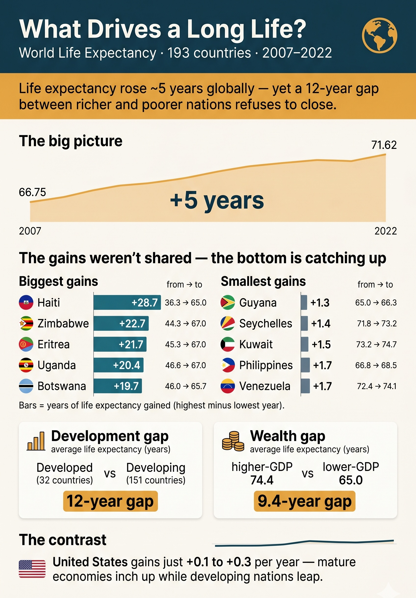

# World Life Expectancy — What Drives a Long Life?

Data cleaning and exploratory analysis of global life-expectancy data — **193 countries, 2007–2022** — built entirely in **MySQL**. A pure-SQL showcase: take a messy public-health dataset to an analysis-ready state, then surface what's actually associated with a long life.

**▶ [Read the full case study](ADD-YOUR-NOTION-LINK)** — the polished write-up with every query, the before/after screenshots, and the methodology notes.

<p align="center">
  
</p>

## The story in one line

Life expectancy rose **~5 years globally** (66.75 in 2007 → 71.62 in 2022), yet a **12-year gap** between Developed and Developing nations persists and **wealth tracks longevity by ~9 years** — the bottom is converging upward while the top sits near a ceiling.

## What's inside

The project runs in two acts:

- **Act 1 — Data cleaning.** Remove duplicate country-years, back-fill blank development status via self-join, and repair the headline metric — including the catch that 10 "zeros" were missing data masquerading as real values. Every gap is either fixed with justification or excluded transparently; nothing fabricated.
- **Act 2 — Exploratory analysis.** A narrative arc: the global rise, the uneven (converging) gains, the development-status gap, the wealth gap, and a year-over-year window-function demo.

## Key findings

- **Life rose ~5 years globally** — 66.75 → 71.62.
- **The gain was uneven** — fastest risers are developing nations climbing from low baselines (Haiti +28.7, Zimbabwe +22.7); smallest movers sit near a ceiling (Guyana +1.3). Convergence, not uniform growth.
- **A 12-year development gap** — Developed 79.2 vs Developing 67.1.
- **Wealth tracks longevity** — a 9.4-year gap above vs below the GDP split.
- **Mature economies inch up** — the US gains +0.1 to +0.3/yr, the mirror image of the fast-converging bottom.

## Repository structure

```
world-life-expectancy-sql/
├── data/
│   └── WorldLifeExpectancy.csv                       raw dataset
├── sql/
│   ├── 13_1_World_Life_Expectancy_Data_Cleaning.sql  Act 1 — cleaning
│   └── 13_2_World_Life_Expectancy_EDA.sql            Act 2 — EDA
└── screenshots/                                      query outputs + infographic
```

## Skills demonstrated

Window functions (`ROW_NUMBER`, `LAG`) · single and triple self-joins · data-quality auditing · NULL / missing-data judgment · conditional aggregation (`CASE` in `SUM`/`AVG`) · `GROUP BY` / `COUNT(DISTINCT)` · medallion architecture thinking (Bronze → Silver → Gold).

## How it maps to a production stack

Built in MySQL, but the shape is deliberately production-grade — a staging → clean → serve flow, i.e. the medallion model. On Azure/Fabric the same work splits cleanly: Azure Data Factory orchestrates and lands raw data (Bronze), the Act 1 cleaning runs as T-SQL in a Fabric Warehouse (Silver), and the Act 2 queries become warehouse views feeding a Power BI semantic model (Gold). MySQL → T-SQL is a dialect change, not a re-skill. Full reasoning is in the [case study](https://aboard-aftershave-7a6.notion.site/World-Life-Expectancy-What-Drives-a-Long-Life-37766a9c434c811bbd9edfb906e8d78d).

